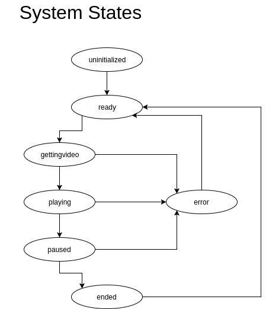

# iot-tv-controller



Sending inputs to the FSM:  
1. Member functions (inputs) defined on the fsm object (preferred method)  
```
var fsm = new machina.Fsm({
    states: {
        a: {
            ...
            do_job: function (args2) {
                this.transition("b");
            }
        },
        b: {...}
    },
    run: function (args) {
        this.transition("b");
    },
    run2: function (args2) {
        this.handle("do_job", args2);
    }
    ...
});
...
fsm.run(args); // transitions into state b from any state
fsm.run2(args2); // transitions into state b if in state a
```

1. Event handler on the fsm object:  
    * listen for the event on the fsm object:
    ```
    fsm.on("eventname", callback)
    ```
    `callback` may invoke a transition or handler.  
    
    * then emit some custom event on the fsm object:
    ```
    fsm.emit("eventname", arg) // fsm runs the callback with arg
    ```
    
